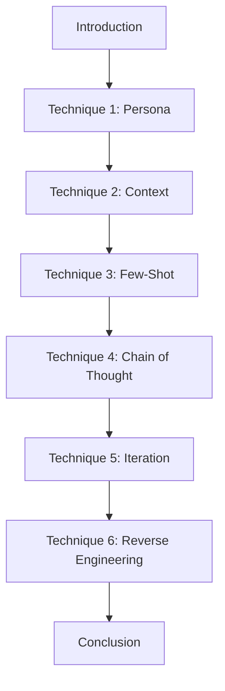
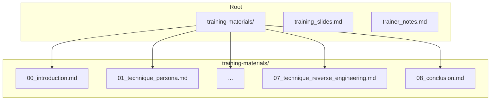

# System Patterns

This document outlines the system architecture, key technical decisions, and design patterns used in the project. For this project, it defines the content architecture for the training module.

## System Architecture

- (To be filled in with diagrams and descriptions)

## Key Technical Decisions

- (To be filled in)

## Content Architecture: Training Module Structure

The training content will be structured as a journey, guiding the user from basic concepts to advanced application, now including a new technique.

## Key Content Decisions

- **Analogy-Driven:** Each core technique will be introduced with a simple, memorable analogy (e.g., "Wear This Hat") to make it less intimidating and easier to recall.
- **Scaffolded Learning:** The techniques build on each other, from simple (assigning a persona) to complex (combining all techniques for a full workflow).
- **Role-Specific Examples:** Every technique will be illustrated with examples directly relevant to the tasks of a Business Analyst or System Analyst creating documentation.

## Design Patterns

- **Before-and-After:** Examples will use a "Simple Prompt vs. Advanced Prompt" format to clearly demonstrate the value of each technique.
- **Contextualization:** All examples will explicitly reference the `AIDevX` environment and its specific assistants (e.g., "When using the 'Generate Requirements' assistant...").
- **Interactivity:** Each of the five core techniques in the detailed documentation will now include a dedicated sub-section titled "Interactive Workshop Activity" which will outline a practical, collaborative exercise.

## Final Deliverable File Structure

- A `training-materials/` directory will hold the detailed, professional documentation.
- A final, summarized `training_slides.md` will be created at the root level.
- A new, comprehensive `trainer_notes.md` will also be created at the root level. 